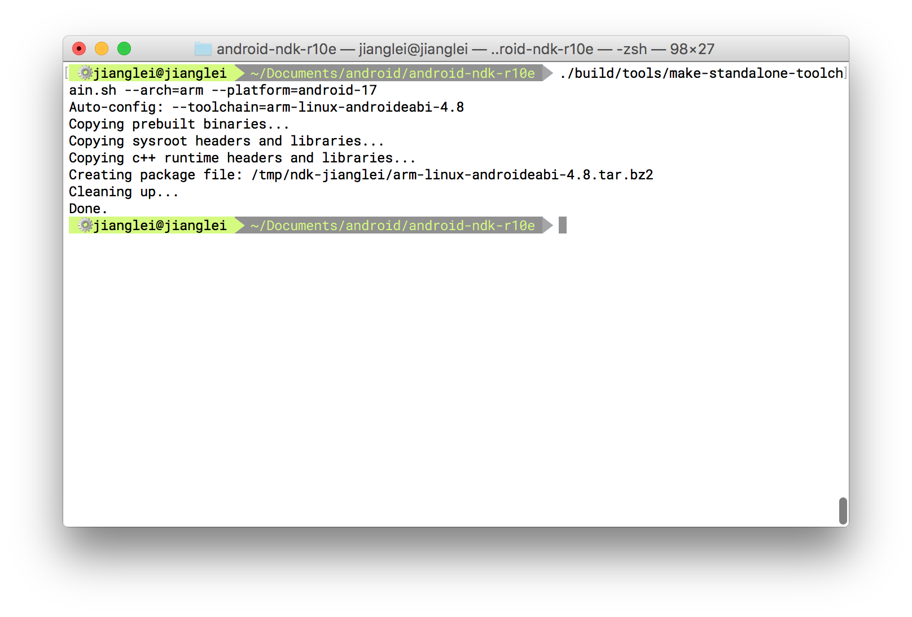
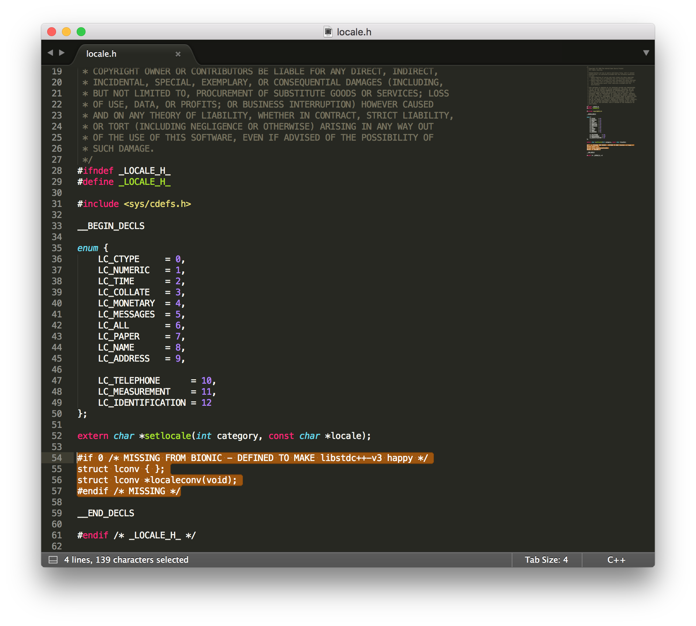
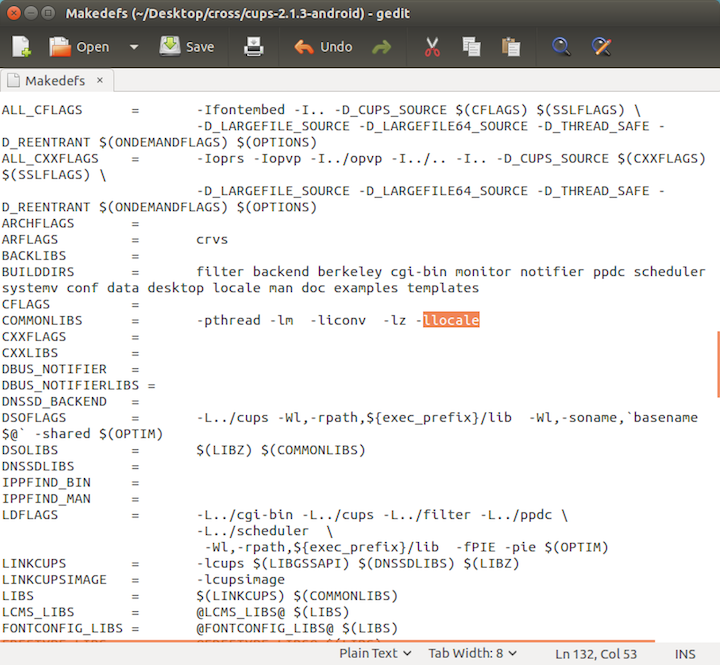
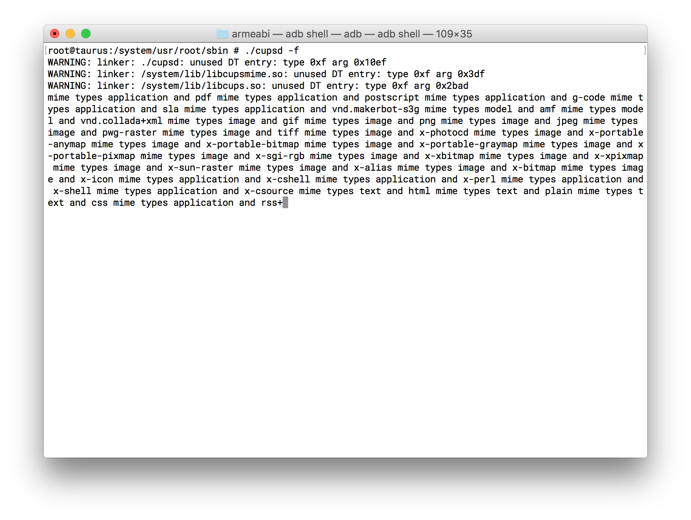
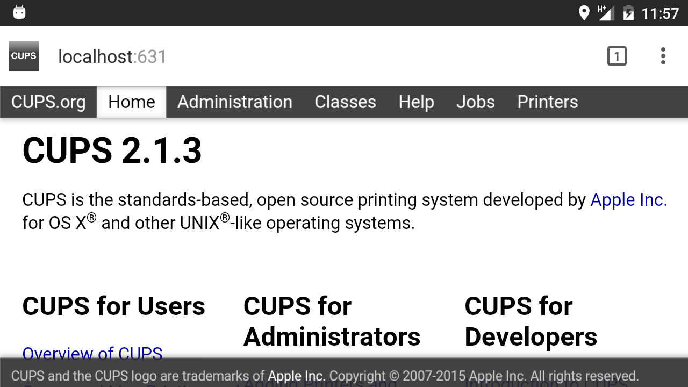
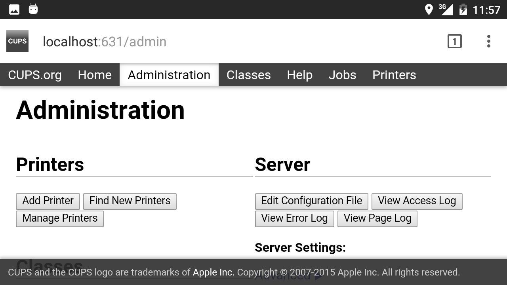
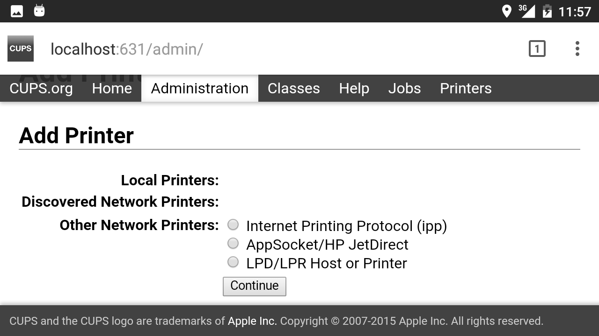
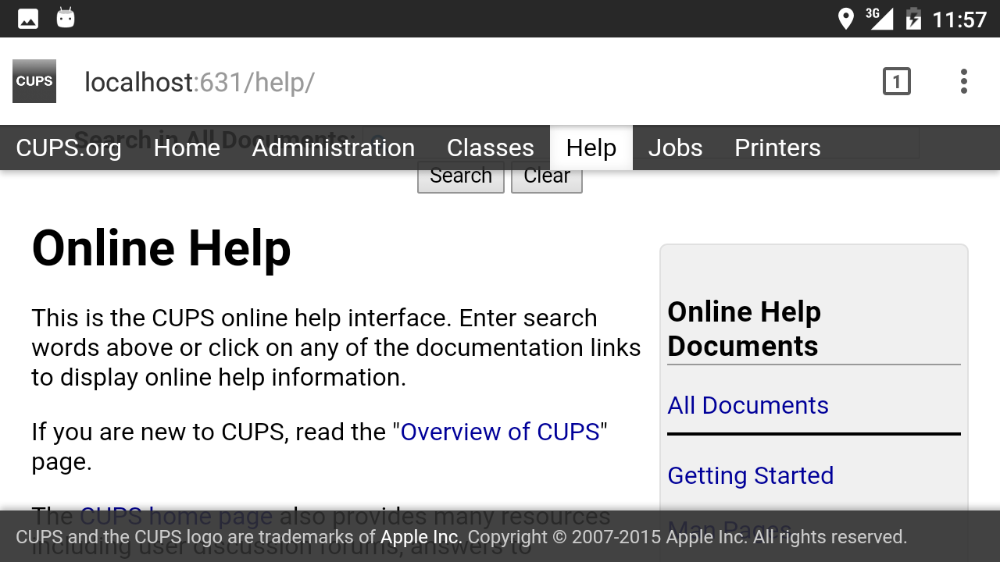

##How to build cups for android

First of all, forgive my poor English. This is a guide to build cups for android platform, I have modified some files of cups project, to build cups successfully, you should do like this:

####1.Get source code

source code should use what i provide in this repository, the cups version is 2.1.3.  Just use git clone:

```shell
git clone https://github.com/jianglei12138/cups.git
```

or download this code by click the download button.

####2.Configure you environment

It is suggest to use cross compiler toolchain which exported by NDK.

In termial, just `cd` your NDK path (must in this folder) and input 

```shell
./build/tools/make-standalone-toolchain.sh --arch=arm --platform=android-17
```

just like this:



then you'll be able to find you toolchian under `/tmp` folder. Just put it where you like and unzip. Once your toolchain has ready, you need change some file.

- modify the `locale.h` under  toolchain-folder/sysroot/usr/include, change `if 1` to `if 0` 


- get the lcoale support library and library from my another  [repositories](https://github.com/jianglei12138/liblocale), then put the header locale12138.h under toolchain-folder/sysroot/usr/include and the shared librari liblocale.so to toolchain-folder/sysroot/usr/lib
- add toolchain bin path to your environment variable

####3.Configrue cups

Just cd cups folder and configure:

```shell
./configure --host=arm-linux-androideabi  --disable-dbus --prefix=/system/usr/root --with-cups-user=system --with-cups-group=system --with-system-groups=root
```

I put all aim files to `/system/usr/root` which in android system, so i used `—prefix` .You maybe found some error during configure ,but you can find all need libraries in my repositories. Then add liblocale support in Makedefs file `COMMONLIBS = -pthread -lm  -liconv  -lz -llocale`



####4.Make

Then just make

```shell
make
```

####5.Make install

make install need root permission，so you must under sudo before you make install.

Then make install

```shell
make install
```

####6.Make all ready

+ push liblocale.so to android system lib 

  ```shell
  adb push liblocale /system/lib
  ```


+ copy all the files to the android system. You can use adb push, but this will ignore some folder, so I suggest just put the zip file to the android system folder and install an app which named busybox (you'll get unzip command), and unzip the zip file to you corrent location. Anyway, you can copy aim files to sdcard and use RootExplorer copy them to the correct path, don't forget give correct promission.


+ copy libraries under cups/lib to /system/lib

####7.start cupsd

You can start cupsd by adb shell or you can install an app terminal for android. And all this should be under root.(The mime in the picture was i added to debug).



####8.Test

Now, you could be able to open brower to see if the cups running successfully.

Home page:




Administration page, and the administrator is root and password is whatever except null.




Add Printer Pagr:




Help pager:




From now on, you could add some printer, but you maybe need other cups-filters to print successfully. CUPS-filters could be found in my [repository](https://github.com/jianglei12138/cups-filters) 
