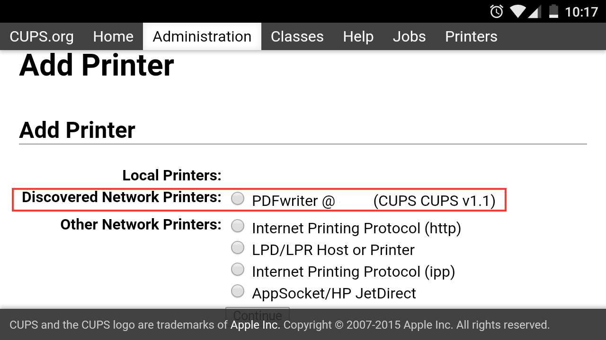

## How to build cups for android

This is a guide to build cups for android platform, I have modified some files of cups project, to build cups successfully, you should do like this:

#### 1.Get source code

Just use git clone:

```shell
git clone https://github.com/jianglei12138/cups.git
```

or download cups-2.4.10-android-port.patch.

#### 2.Configure you environment

It is suggest to use cross compiler toolchain which exported by NDK.

In termial, just `cd` your NDK path (must in this folder) and input 

```shell
./build/tools/make-standalone-toolchain.sh --arch=arm --platform=android-21
```

just like this:


then you'll be able to find you toolchian under `/tmp` folder. Just put it where you like and unzip. Once your toolchain has ready, you need change some file.

- add toolchain bin path to your environment variable
- if you want to enable dns_sd, you can put libdns_sd's header and library into toolchain sysroot. And libdns_sd for android could be found in my resposity.
- if you want to enable avahi, you can put avahi header and library into toolchain sysroot. And libavahi-common,libavahi-core,libavahi-client for android could be found in my resposity.

#### 3. Patch and configrue cups

download cups-2.4.10 and apply patch (use patch command) **cups-2.4.10-android-port.patch**

configure:

```shell
./configure --host=arm-linux-androideabi  --disable-dbus --prefix=/system/usr/root --with-cups-user=system --with-cups-group=system --with-system-groups=root
```

we wannt push all files to android `/system/usr/root`,  so `--prefix` is necessary, you maybe found some deps error during configure, but can find all need libraries in my repositories. 

#### 4.Make

Then just make

```shell
make
```

#### 5.Make install

make install need root permission，so you must under sudo before you make install.

Then make install

```shell
make install
```

#### 6.Make all ready

+ copy all the files to the android system. You can use adb push, but this will ignore some folder, so I suggest just put the zip file to the android system folder and install an app which named busybox (you'll get unzip command), and unzip the zip file to you corrent location. Anyway, you can copy aim files to sdcard and use RootExplorer copy them to the correct path, don't forget give correct promission.


+ copy libraries under cups/lib to /system/lib

#### 7.start cupsd

You can start cupsd by adb shell or you can install an app terminal for android. And all this should be under root.(The mime in the picture was i added to debug).


#### 8.Test

Now, you could be able to open brower to see if the cups running successfully.

Home page:


Administration page, and the name and passowrd see patch code


Add Printer Page:


if you enable avahi or dns-sd support, you can find your network printers like this



Help pager:


From now on, you could add some printer, but you maybe need other cups-filters to print successfully. CUPS-filters could be found in my [repository](https://github.com/jianglei12138/cups-filters) 

#### 9.Attention!

Cross compile on MacOS wes not test. Recommand OS is Ubuntu or other linux distribution 
